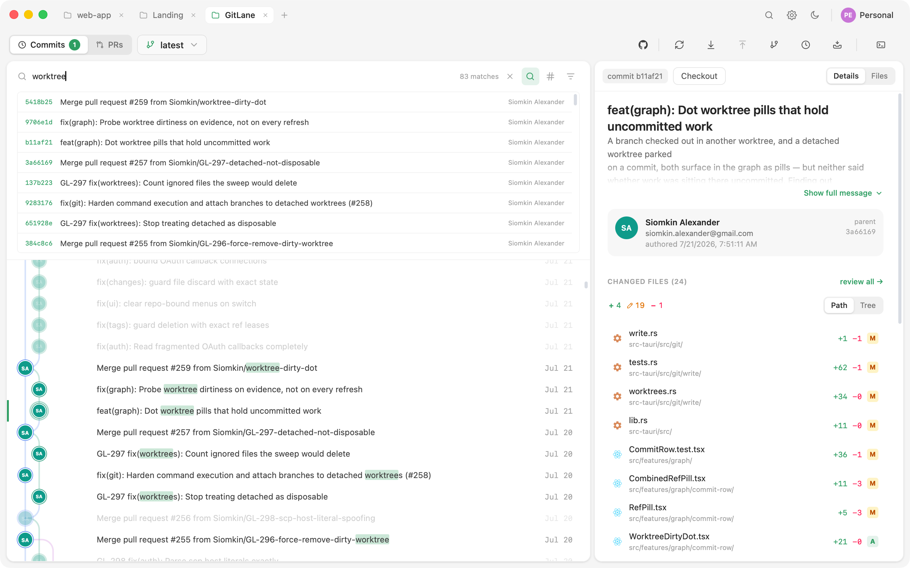
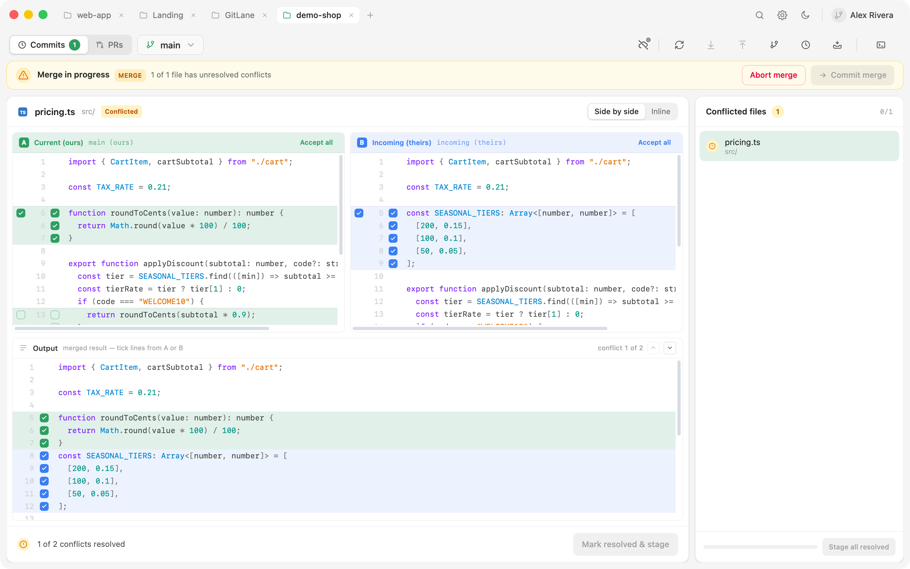

# GitLane

**See your branches. Move them.** GitLane is a fast, lightweight visual git
client for **macOS, Windows, and Linux** — a free, open-source alternative to
GitKraken, Sourcetree, and Fork. A swimlane commit tree with drag-and-drop
branch operations, staging down to the single line, in-app merge-conflict
resolution, and GitHub, GitLab, and Bitbucket pull requests without leaving
the app.

[](https://github.com/Siomkin/GitLane/releases)
[](https://github.com/Siomkin/GitLane/releases)

[](LICENSE)


**[Why GitLane](#why-gitlane) · [Features](#features) · [Install](#install) ·
[Build from source](#build-from-source) · [Contributing](#contributing) ·
[Architecture](#architecture)**

## Why GitLane

- **A commit graph you can actually read.** Every line of history gets its own
  lane and color. The layout is computed in Rust and painted on canvas, so it
  stays smooth on histories with thousands of commits.
- **Your real git, not a reimplementation.** Every write — commit, merge,
  rebase, push, stash — runs through your actual `git` binary, so hooks,
  credential helpers, commit signing, and your `.gitconfig` all just work.
  Reads use libgit2 for speed.
- **Always live.** A filesystem watcher keeps the app in sync when you commit,
  checkout, or stage from the terminal. No refresh button.
- **Native and lean.** Tauri, not Electron: a small download that starts
  instantly and stays light on memory.

## Features

### A graph that shows everything

Branches, remotes, tags, stashes, and your uncommitted work all live in one
swimlane tree. Stashes appear at the point in history where you made them,
uncommitted changes float on top as a WIP row, and commit nodes show author
avatars — with badges for co-authors and commits made by bots and AI agents
(Claude, Codex, Cursor, Copilot, Dependabot).

### Drag-and-drop branch operations

Drag one branch onto another and GitLane offers exactly the operations that
make sense — fast-forward, merge, rebase, or reset — based on how the branches
actually relate. No memorizing flags.


Everything else is one right-click away: cherry-pick, revert, or squash a
multi-commit selection, create branches / tags / worktrees at any commit,
compare any two refs, or export a commit as a patch file.

### Find anything, fast

Incremental search highlights matches in place — message, SHA, author, branch
— while everything else dims, so hits stand out without losing their position
in the tree. An advanced mode searches the whole repository, not just the
loaded window: message regex, author, file path (with autocompletion), date
range, and git's pickaxe ("which commit changed this code?"). Click a result
and the graph pages in as much history as it takes to land on it.



The branch navigator (<kbd>Cmd/Ctrl</kbd>+<kbd>Alt</kbd>+<kbd>F</kbd>) does
the same for refs: branches, remotes, worktrees, tags, and stashes in one
searchable, pinnable palette — click anything to jump the graph to it.

### Staging down to the line

Stage whole files, folders, individual hunks — or a single line. The commit
composer shows exactly who you're committing as and where it will land, with
a Conventional Commits mode, amend support, and one-click
commit-and-push. If you have an AI CLI installed (`claude`, `codex`, …),
GitLane can draft or improve the commit message from your staged diff.


Diffs come in unified or split view with syntax highlighting, a change
minimap, before/after image previews, and Markdown preview. Review a whole
commit — or a multi-commit selection's combined diff — as one scrollable
stack, and attach local review notes you can hand to an AI agent as an
instruction.

### Merge conflicts, resolved in-app

When a merge, rebase, cherry-pick, or revert stops on conflicts, GitLane
becomes a conflict workspace: resolve hunk-by-hunk in an inline or
side-by-side editor, take ours/theirs per file, handle binary and
modify/delete conflicts, then continue, skip, or abort the operation — all
without touching the terminal. Files resolved in an outside editor can be
staged as-is, and a staged resolution can be un-staged to redo it.



### Pull requests without leaving the app

Browse, review, and merge pull requests for the repo you have open. GitHub
gets the full experience; GitLab merge requests and Bitbucket Cloud pull
requests cover the core workflow:

| Capability | GitHub | GitLab | Bitbucket |
| --- | :-: | :-: | :-: |
| List, detail, full diff, commits | ✅ | ✅ | ✅ |
| Create PR/MR (incl. drafts) | ✅ | ✅ | ✅ |
| Merge (merge commit / squash) | ✅ | ✅ | ✅ |
| Rebase merge | ✅ | — | — |
| Approve | ✅ | ✅ | ✅ |
| Comments, review threads, request changes | ✅ | not yet | not yet |
| CI checks (live polling) | ✅ | not yet | not yet |
| Close / reopen / mark ready | ✅ | not yet | not yet |

<sub>*not yet* = planned in GitLane · — = not offered for that forge</sub>

GitHub works through the [GitHub CLI](https://cli.github.com) (`gh`) —
including multiple accounts and GitHub Enterprise. GitLab works through an
installed `glab` CLI or a personal access token; Bitbucket through an
Atlassian API token (legacy app passwords work too) — tokens are added in
Settings → Accounts, stored in your OS keychain, and never exposed to the UI
layer.

Repos on other forges (Azure DevOps, Gitea, Forgejo/Codeberg) work fine for
everything else — commit, branch, push, pull. Only the pull-request view is
unavailable there, and it says so plainly instead of failing with a cryptic
error.


### Safety rails everywhere

Every destructive action shows you its exact impact before it runs: reset and
branch-delete preview the commits that would fall away, discard previews the
work that would be thrown out, and force-push previews the remote commits it
would replace. If the repo changed under you between preview and confirm —
say, from a terminal — the operation fails cleanly instead of acting on stale
state. Force-push always uses `--force-with-lease`. And if something still
goes wrong, the **Recover** button browses the reflog to branch back to any
lost commit.

### Accounts authenticate, identities author

Sign into several GitHub / GitLab / Bitbucket accounts at once and pick which
one each remote uses — stored git-natively in the HTTPS remote URL, so it
works identically from a terminal (SSH remotes pick their account by key). Completely separate, reusable **identity cards**
(name, email, optional GPG/SSH signing key) decide who each repo commits as,
applied to local git config only — so you never commit to a client repo with
the wrong email or an unverified signature. A repo is fully usable with no
account connected at all.

### Worktrees, stashes, tags, terminal

- **Worktrees** — create, open (in a tab), and remove linked worktrees; hand a
  branch off to another worktree *carrying its uncommitted changes*, with a
  live progress checklist.
- **Stashes** — one-click stash; apply, pop, drop, or turn a stash into a new
  branch. Stashes are addressed by commit id, so a shifted `stash@{n}` index
  can never drop the wrong one.
- **Tags** — lightweight or annotated (and signed), push to / delete from a
  remote, create branches or worktrees from a tag.
- **Integrated terminal** — real PTY tabs running your login shell in the repo
  directory, with one-click launchers for AI coding agents. Anything you do
  there shows up in the UI instantly.

### And the everyday things

Multi-repo tabs with session restore · file history and blame · in-repo file
browser with a guarded text editor · background auto-fetch · fast-forward-only
pull with explicit divergence handling · dark/light/system themes with nine
accent colors · compact/comfortable density · persistent layout · built-in
auto-updates with stable and beta channels.

## Install

**Requirements:** `git` **2.36+** on your `PATH`. Optional: [GitHub CLI](https://cli.github.com)
`gh` **2.95+** signed in (`gh auth login`) for GitHub pull requests, `glab`
signed in for GitLab merge requests.

Grab the latest build from the
[**Releases page**](https://github.com/Siomkin/GitLane/releases):

| Platform | Package |
| --- | --- |
| macOS (Apple Silicon) | `GitLane-<version>-macos-arm64-dmg.dmg` |
| macOS (Intel) | `GitLane-<version>-macos-x86_64-dmg.dmg` |
| Windows | `GitLane-<version>-windows-nsis.exe` |
| Linux | `.deb` / `.rpm` (recommended) or `.AppImage` |

> [!IMPORTANT]
> Builds aren't code-signed yet, so macOS Gatekeeper and Windows SmartScreen
> block the **first launch** with a scary-looking warning. This is expected,
> not a broken download — see the one-time fix for your OS below. Signing and
> notarization are planned ([docs/distribution.md](docs/distribution.md)).

<details>
<summary><strong>macOS: first launch</strong></summary>

GitLane isn't notarized by Apple yet, so after downloading, Gatekeeper blocks
the app — typically with *"GitLane is damaged and can't be opened"* (Apple
Silicon) or *"unidentified developer"* (Intel). The app is fine; macOS flags
every non-notarized download this way. Clear the quarantine flag once after
copying it to Applications:

```bash
xattr -dr com.apple.quarantine /Applications/GitLane.app
```

Then launch normally. On some systems right-click → **Open**, or
System Settings → **Privacy & Security** → **Open Anyway** after the first
blocked launch, works instead. In-app updates delivered by the updater don't
need this again.

</details>

<details>
<summary><strong>Windows: first launch</strong></summary>

Defender SmartScreen blocks a fresh download — *"Windows protected your PC"*,
unknown publisher, with no obvious way to continue. Click **More info**, then
**Run anyway**. The installer is fine; Windows treats every unsigned download
this way.

The installer installs for the current user — no admin rights needed — and
in-app updates delivered by the updater don't retrigger SmartScreen.

</details>

<details>
<summary><strong>Linux: pick a package</strong></summary>

Prefer the **`.deb`** (Debian, Ubuntu, Mint) or **`.rpm`** (Fedora, openSUSE)
package — it gives a normal install: app-menu entry, icon, and clean uninstall
through your package manager.

```bash
sudo apt install ./GitLane-<version>-linux-deb.deb      # Debian / Ubuntu / Mint
sudo dnf install ./GitLane-<version>-linux-rpm.rpm      # Fedora / RHEL
sudo zypper install ./GitLane-<version>-linux-rpm.rpm   # openSUSE
```

The **`.AppImage`** is the portable fallback for every other distribution.
Browsers never preserve the executable bit, so make it executable once:

```bash
chmod +x GitLane-<version>-linux-appimage.AppImage
./GitLane-<version>-linux-appimage.AppImage
```

A bare AppImage doesn't integrate with the desktop (no app-menu entry or
icon); [Gear Lever](https://flathub.org/apps/it.mijorus.gearlever) or
[AppImageLauncher](https://github.com/TheAssassin/AppImageLauncher) can add
that.

</details>

GitLane updates itself through the built-in signed updater, on a **stable**
or **beta** channel (toggle in Settings → About) — see
[docs/release-channels.md](docs/release-channels.md). The `.sig`,
`.app.tar.gz`, and `latest.json` release assets are for the auto-updater; you
never need to download them.

**First run:** open or clone a repository, then try dragging one branch pill
onto another — or press <kbd>Cmd/Ctrl</kbd>+<kbd>Alt</kbd>+<kbd>F</kbd> to
jump anywhere in the repo.

## Build from source

Prerequisites: [`bun`](https://bun.sh), the [Rust toolchain](https://rustup.rs),
`git`, and your platform's
[Tauri system dependencies](https://v2.tauri.app/start/prerequisites/)
(webkit2gtk on Linux, Xcode CLT on macOS, MSVC Build Tools + WebView2 on
Windows).

```bash
bun install
bun run tauri build
```

Source builds don't use the in-app updater — pull and rebuild to update.
No signing warnings either: you compiled it yourself.

## Contributing

```bash
bun install
bun run tauri dev      # launch the app with hot reload
bunx tsc --noEmit && bun run test          # frontend checks
(cd src-tauri && cargo check)              # Rust checks
```

See [CONTRIBUTING.md](CONTRIBUTING.md) to get started, and
[docs/rules/architecture-rules.md](docs/rules/architecture-rules.md) for the
rules that keep changes consistent. Bug reports and feature requests are
welcome in [issues](https://github.com/Siomkin/GitLane/issues).

## Architecture

- **Shell:** Tauri 2 — native window, small footprint
- **Frontend:** React 19 + TypeScript + Vite; canvas-rendered commit graph;
  Zustand state
- **Git reads:** [`git2`](https://docs.rs/git2) (libgit2), network features
  disabled
- **Git writes:** shell out to your real `git` binary — honours hooks,
  credentials, config, signing, and the full conflict machinery
- **Provider APIs:** GitHub via `gh`, GitLab via `glab`/REST, Bitbucket via
  REST; tokens live in the OS keychain / CLI and never reach the frontend
- **Graph layout:** computed in Rust — a topological walk assigns each commit
  a lane via a reservation scheme; the frontend just paints coordinates

The deeper map — module layout, IPC contract, read/write split — lives in
[CLAUDE.md](CLAUDE.md) (the contributor briefing that doubles as the
architecture guide) and [docs/](docs/).

## License

GitLane is free software under **GPL-3.0-or-later** — see [LICENSE](LICENSE).
You may use, study, modify, and redistribute it; distributed derivatives must
stay under the GPL with complete source. The GitLane name and logo may be
protected as trademarks; the GPL grants copyright permissions, not trademark
rights.
