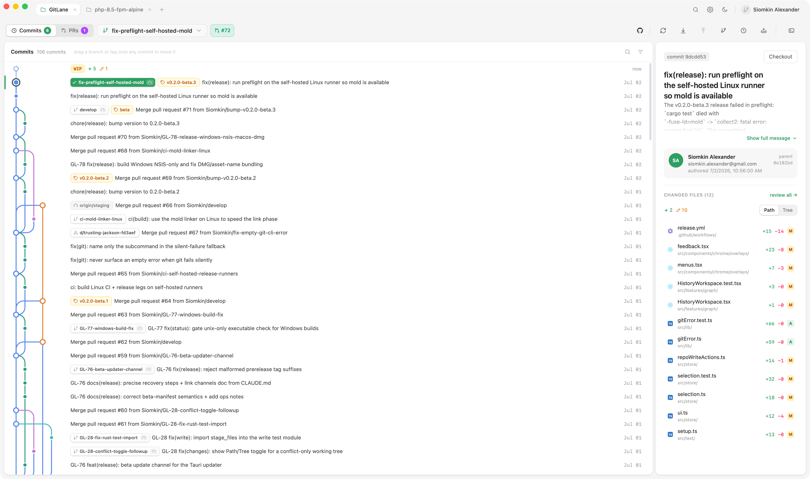
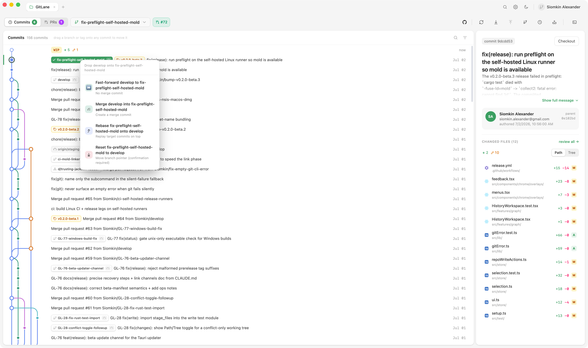
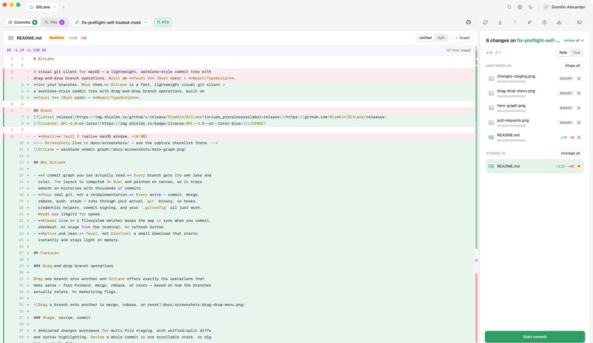
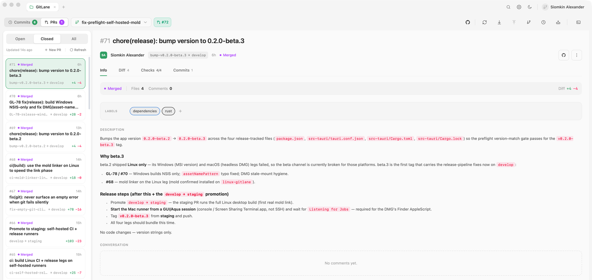

# GitLane

**See your branches. Move them.** GitLane is a fast, lightweight visual git client
for **macOS, Windows, and Linux** — a free, open-source alternative to GitKraken,
Sourcetree, and Fork, with a swimlane-style commit tree and drag-and-drop branch
operations. Built on **Tauri 2** (Rust core) + **React/TypeScript**, it browses
GitHub, GitLab, and Bitbucket pull requests too.

[](https://github.com/Siomkin/GitLane/releases)
[](LICENSE)

<!-- Screenshots live in docs/screenshots/ — see the capture checklist there. -->


## ⚠️ Not code-signed yet

macOS builds are ad-hoc signed but not Apple notarized, and Windows builds are
not Authenticode-signed. **The apps are safe and work fine** — but macOS
Gatekeeper and Windows SmartScreen will block the first launch of a downloaded
release with a scary-looking warning. This is expected, not a broken download.
You have two ways around it:

| Option | What you get |
| --- | --- |
| **[Build from source](#build-from-source)** | No signing warnings at all — you compiled it yourself |
| **[Download a release](#download-a-release)** | Fastest install; one-time unblock step — see [macOS: first launch](#macos-first-launch) / [Windows: first launch](#windows-first-launch) |

Developer ID signing + notarization (which removes this step entirely) is
planned — see [docs/distribution.md](docs/distribution.md).

## Get GitLane

### Build from source

Prerequisites: `bun`, the Rust toolchain, and `git`.

```bash
bun install
bun run tauri build
```

Source builds use the repository's baseline version metadata and do not use the
built-in release updater. Pull the latest source and rebuild to update; official
release artifacts enable signed in-app updates during the release workflow.

For development with hot reload:

```bash
bun run tauri dev
```

Optional, for GitHub/PR features: [GitHub CLI](https://cli.github.com) `gh`
**2.95.0 or newer**, logged in (`gh auth login`).

### Download a release

Grab the latest build from the
[**Releases page**](https://github.com/Siomkin/GitLane/releases).

| Platform | Package |
| --- | --- |
| macOS (Apple Silicon) | `GitLane-<version>-macos-arm64-dmg.dmg` — see [macOS: first launch](#macos-first-launch) |
| macOS (Intel) | `GitLane-<version>-macos-x86_64-dmg.dmg` — see [macOS: first launch](#macos-first-launch) |
| Windows | `GitLane-<version>-windows-nsis.exe` — see [Windows: first launch](#windows-first-launch) |
| Linux | `.deb` / `.rpm` (recommended) or `.AppImage` — see [Linux: pick a package](#linux-pick-a-package) |

The `.sig` assets are signatures for the built-in updater — you never need to
download them.

GitLane updates itself through the built-in Tauri updater. Builds ship on two
channels — **stable** and **beta** (pre-releases, updated more often); see
[docs/release-channels.md](docs/release-channels.md).

### macOS: first launch

GitLane isn't notarized by Apple yet, so after downloading, Gatekeeper blocks
the app — typically with *"GitLane is damaged and can't be opened"* (Apple
Silicon) or *"unidentified developer"* (Intel). The app is fine; macOS flags
every non-notarized download this way. Clear the quarantine flag once after
copying it to Applications:

```bash
xattr -dr com.apple.quarantine /Applications/GitLane.app
```

Then launch normally. On some systems right-click → **Open**, or
System Settings → **Privacy & Security** → **Open Anyway** after the first
blocked launch, works instead. In-app updates delivered by the updater don't
need this again.

Developer ID signing + notarization (which removes this step) and a Homebrew
cask are planned — see [docs/distribution.md](docs/distribution.md).

### Windows: first launch

The Windows build isn't code-signed yet, so Defender SmartScreen blocks a
fresh download — *"Windows protected your PC"*, unknown publisher, with no
obvious way to continue. Click **More info**, then **Run anyway**. The
installer is fine; Windows treats every unsigned download this way. Code
signing is planned and will remove this prompt.

The installer (`GitLane-<version>-windows-nsis.exe`) installs for the current
user — no admin rights needed — and in-app updates delivered by the updater
don't retrigger SmartScreen.

### Linux: pick a package

Prefer the **`.deb`** (Debian, Ubuntu, Mint) or **`.rpm`** (Fedora, openSUSE)
package — it gives a normal install: app-menu entry, icon, and clean uninstall
through your package manager.

```bash
# Debian / Ubuntu / Mint
sudo apt install ./GitLane-<version>-linux-deb.deb

# Fedora / RHEL
sudo dnf install ./GitLane-<version>-linux-rpm.rpm

# openSUSE
sudo zypper install ./GitLane-<version>-linux-rpm.rpm
```

The **`.AppImage`** is the portable fallback for every other distribution (or
when you can't install packages). Browsers never preserve the executable bit,
so make it executable once before the first run:

```bash
chmod +x GitLane-<version>-linux-appimage.AppImage
./GitLane-<version>-linux-appimage.AppImage
```

A bare AppImage doesn't integrate with the desktop (no app-menu entry or
icon). If you want that, run it through
[Gear Lever](https://flathub.org/apps/it.mijorus.gearlever) or
[AppImageLauncher](https://github.com/TheAssassin/AppImageLauncher).

Package-manager channels (Flathub, AUR) are tracked in
[docs/distribution.md](docs/distribution.md).

### Runtime requirements

- `git` on your `PATH` (writes go through your real git).
- Optional, for GitHub/PR features: [GitHub CLI](https://cli.github.com) `gh`
  **2.95.0 or newer**, logged in (`gh auth login`).
- Other forges (GitLab, Bitbucket, Azure DevOps, Gitea, Forgejo): core git
  features work through your normal git transport credentials. GitLab and
  Bitbucket PR/MR support can use provider credentials configured in GitLane.

## Why GitLane

- **A commit graph you can actually read.** Every branch gets its own lane and
  color. The layout is computed in Rust and painted on canvas, so it stays
  smooth on histories with thousands of commits.
- **Your real git, not a reimplementation.** Every write — commit, merge,
  rebase, push, stash — runs through your actual `git` binary, so hooks,
  credential helpers, commit signing, and your `.gitconfig` all just work.
  Reads use libgit2 for speed.
- **Always live.** A filesystem watcher keeps the app in sync when you commit,
  checkout, or stage from the terminal. No refresh button.
- **Native and lean.** Tauri, not Electron: a small download that starts
  instantly and stays light on memory.

## Features

### Drag-and-drop branch operations

Drag one branch onto another and GitLane offers exactly the operations that
make sense — fast-forward, merge, rebase, or reset — based on how the branches
actually relate. No memorizing flags.



### Stage, review, commit

A dedicated changes workspace for multi-file staging, with unified/split diffs
and syntax highlighting. Review a whole commit as one scrollable stack, or dig
into a single file.



### Pull requests and merge requests

Browse GitHub pull requests, GitLab merge requests, and Bitbucket pull
requests without leaving the app. GitHub uses the GitHub CLI (`gh`), while
GitLab and Bitbucket use provider credentials configured in GitLane. Tokens
stay in the Rust core.



### Commit identity you can trust

Reusable **identities** (name, email, optional signing key) apply per
repository, separately from provider accounts — so you never accidentally
commit to a client repo with the wrong email or an unverified signature.

### And the everyday tools

Branch/tag/remote navigator, stash management, git worktrees, an integrated
terminal, dark/light themes with accent colors.

## Develop

Prerequisites: `bun`, the Rust toolchain, `git`, and optionally `gh` 2.95.0+
for GitHub/PR features.

```bash
bun install
bun run tauri dev      # launch the app (hot-reloads frontend + Rust)
```

Other:

```bash
bun run build          # tsc + vite production build
bun run test           # frontend tests (vitest)
(cd src-tauri && cargo check)
(cd src-tauri && cargo fmt --all -- --check)
(cd src-tauri && cargo clippy --all-targets --all-features -- -D warnings)
```

Rust, rustfmt, and Clippy are pinned by `rust-toolchain.toml` and selected
automatically by rustup.

GitLane currently validates `gh` 2.95.0 as the minimum supported GitHub CLI baseline:

| Capability | Probe |
| --- | --- |
| Version | `gh version` |
| Host-aware account discovery | `gh auth status --json hosts` |
| Host/user token resolution | `gh auth token --hostname <host> --user <login>` |
| PR patches | `gh pr diff --patch --color never` |
| GraphQL | `gh api graphql` |

## Architecture

- **Shell:** Tauri 2 (native window, ~10 MB)
- **Frontend:** React 19 + TypeScript + Vite, Canvas-rendered commit graph, Zustand state
- **Git reads:** [`git2`](https://docs.rs/git2) (libgit2) — log, refs, branches (network features disabled)
- **Git writes:** shell out to the real `git` binary — honours hooks, credentials, config, conflicts
- **Provider APIs:** GitHub via the GitHub CLI (`gh`) by default; GitLab and Bitbucket via provider-specific clients; tokens stay in Rust and never cross IPC
- **Other forges:** Azure DevOps, Gitea, and Forgejo get explicit unsupported-PR guidance while core git operations still work

```
src/                     # React frontend
  lib/
    api/                 # typed invoke() wrappers → Rust (git, github, terminal; merged in index.ts)
    cn.ts paths.ts highlight.ts prs.ts palette.ts ui.ts   # pure helpers + tokens
  store/                 # Zustand, split by concern: repo · pulls · accounts · ui · selection
  features/              # graph (GraphLayer canvas + palette), changes, review, pull-requests, terminal
  components/
    ui/                  # reusable, domain-free primitives
    chrome/              # window chrome, toolbar, overlays
    navigation/          # branch navigator + PR list panel
  hooks/                 # useLazyDiffs, useDismiss, useRepoWatcher

src-tauri/src/
  auth_providers.rs      # auth-only status probes for non-GitHub forges
  lib.rs                 # Tauri commands (IPC boundary) + generate_handler! registration
  git/
    forge.rs             # known remote forge detection (GitHub, GitLab, Bitbucket, Azure, Gitea, Forgejo)
    types.rs             # serde structs shared with the frontend (camelCase)
    read.rs status.rs    # libgit2 reads: summary, branches, working-tree status, diffs
    graph.rs             # DAG → lane (column) layout algorithm
    write.rs             # checkout/branch/merge/rebase/reset/stage/commit/stash via `git` CLI
    github/              # provider boundary + default `gh` provider
      mod.rs             #   facade: stable `git::github::*` API through GithubService
      domain.rs          #   provider-neutral context, account refs, typed internal errors
      service.rs         #   GithubService + GithubProvider contract
      gh_provider.rs     #   default provider that delegates to the split gh modules
      cli.rs             #   the single `gh` subprocess site (run_gh); accounts/tokens/repo identity
      dto.rs             #   private gh/GraphQL response shapes + domain conversions
      prs.rs             #   PR reads/writes (`gh pr …`) + argument builders
      threads.rs         #   review-thread GraphQL (resolve/unresolve)
      diff.rs            #   PR patch fetch + unified-diff parser
  watcher.rs             # filesystem watcher → repo-changed event
```

### How the graph is laid out

`git/graph.rs` walks the DAG topologically and assigns each commit a **lane**
(column) using a reservation algorithm: every lane holds the id of the parent
commit it's waiting to render. The first parent continues a commit's lane;
merges branch into fresh lanes. The frontend just paints the resulting
`(row, lane, color)` coordinates — no layout logic lives in JS.

## License

GitLane is licensed under the **GNU General Public License v3.0 or later**
(`GPL-3.0-or-later`) — see [LICENSE](LICENSE). This applies to the
software in this repository, including the bundled app icons and other shipped
assets, unless a file states a different license.

In short: you may use, study, modify, and redistribute this software, but any
distributed derivative work must also be released under the GPL with its
complete corresponding source. This keeps GitLane and everything built on it
free and open.

Third-party dependencies retain their own licenses. Check `package.json`,
`bun.lock`, `src-tauri/Cargo.toml`, and `src-tauri/Cargo.lock` for the exact
dependency set before distributing a build.

© 2026 Siomkin Alexander. The GitLane name and logo may be protected as
trademarks; the GPL grants copyright permissions, not trademark rights.
